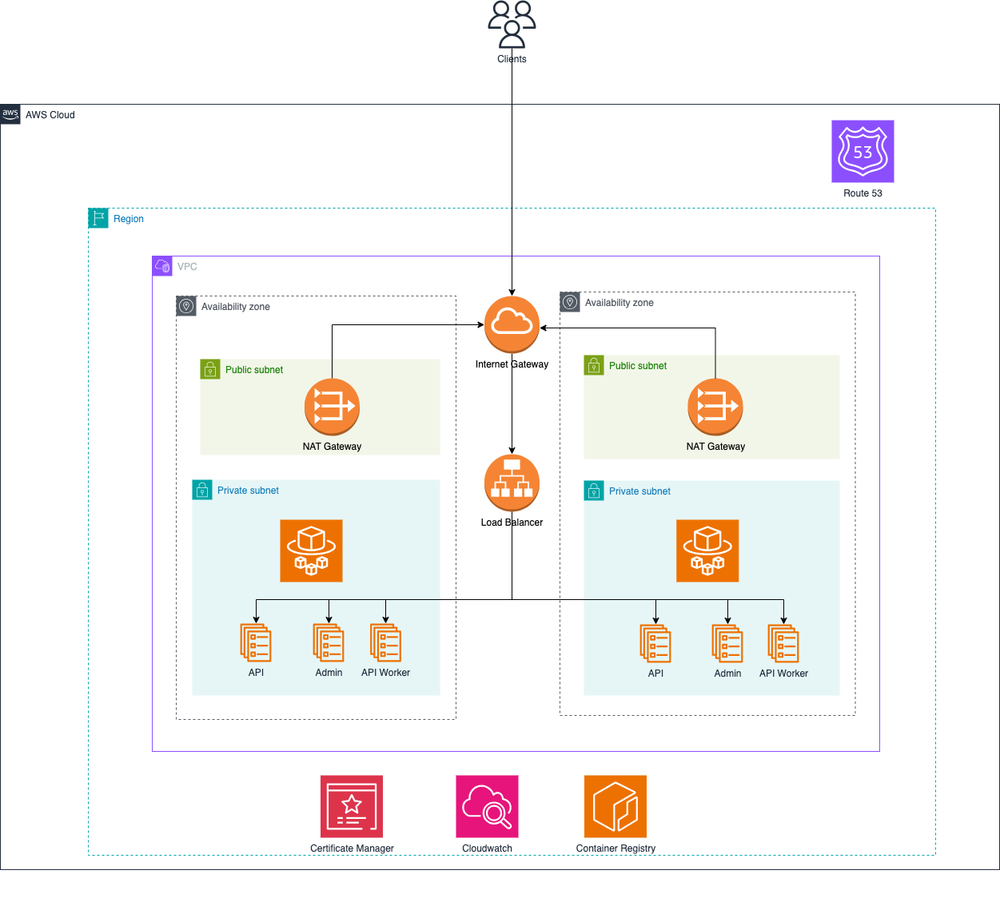

# AWS ECS Deployment with Terraform

This repository contains Terraform scripts for deploying a production-grade container-based application on AWS ECS on Fargate.

## Infrastructure Diagram


## Before You Start

Before you begin with the deployment, ensure that you have the following prerequisites:

- An up-to-date version of [Terraform](http://terraform.io) installed on your computer.
- [AWS CLI](https://docs.aws.amazon.com/cli/latest/userguide/getting-started-install.html) installed on your machine.
- A top-level domain set up in your AWS account.
- A Route 53 Hosted Zone for the top-level domain, and note down the Hosted Zone ID.
- An IAM user with permissions to create all required resources, and AWS CLI credentials set up.
- The `openssl` package installed (used for random hash generation).

## Getting Started

1. Clone the example-Infrastructure repository:

   ```bash
   git clone https://github.com/mrsethsamuel/AWS-ECS-Terraform-Deployment.git
   ```

2. Open `infra/terraform.tfvars` and fill in the necessary values for your deployment.


3. Run the following commands to deploy example-Infrastructure on AWS ECS with Fargate:

```bash
#!/bin/bash

## Simulated hash per deployment, normally used by CI/CD system
HASH=$(openssl rand -hex 12)

cd infra

## Initialize Terraform
terraform init

## Generate Terraform plan file
terraform plan -var hash=${HASH} -out=infrastructure.tf.plan

## Provision resources
terraform apply -auto-approve infrastructure.tf.plan -var hash=${HASH}
rm -rf infrastructure.tf.plan
```

This executes the following tasks:

- Initializes Terraform.
- Runs the `terraform plan` command and generates a local plan file.
- Runs the `terraform apply` command and provisions all ECS on Fargate resources on AWS.
- Builds the application Docker image and pushes it to ECR (the AWS Container registry).

The first time you run the deploy command and all resources are created from scratch, it can take between 5-10 minutes to finish. After the process has finished, check the ECS console in your AWS account to ensure the initial task deployment has been finished.


You should now be able to see the running nginx under the domain you have configured, for example `dev.api.example.co`. The setup uses an HTTPS connection, so even if you call `http://dev.api.example.co`, you are still being redirected to `https://dev.api.example.co`. Now, go ahead to run the ci-cd pipeline to replace the images.

> **Warning**
>
> Avoid interrupting a running Terraform command to prevent a corrupt state file.

## Destroy All Resources

To destroy all your resources, run the following command:

```shell
terraform destroy
```

This command takes some time (usually 5-10 minutes) to finish.